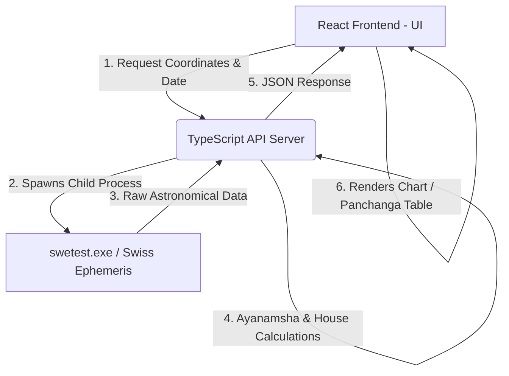

# e-JYOTISHA ప్రాజెక్ట్ - విద్యార్థుల మార్గదర్శిని (Student Guide)

ఈ డాక్యుమెంట్ **e-JYOTISHA** అప్లికేషన్ యొక్క సాంకేతిక నిర్మాణం (Technical Architecture), विभिन्न భాగాలు (Modules) మరియు డేటా ప్రవాహం (Data Flow) గురించి విద్యార్థులకు సులభంగా అర్థమయ్యే రీతిలో వివరిస్తుంది. ఇందులో అడ్మిన్ ప్యానెల్ (Admin Panel) వివరాలు మినహాయించబడ్డాయి.

---

## 1. ప్రాజెక్ట్ అవలోకనం (Project Overview)

**e-JYOTISHA** అనేది ఆధునిక వెబ్ సాంకేతికతలతో నిర్మించబడిన ఒక **Progressive Web App (PWA)**. ఇది సాంప్రదాయ వేద జ్యోతిష్య గణితాన్ని (Vedic Astrology Calculations) డిజిటల్ రూపంలోకి అనువదిస్తుంది. 

### ప్రధాన సాంకేతిక స్టాక్ (Tech Stack):
1. **Frontend**: React.js, Vite (బిల్డ్ టూల్), Vanilla CSS (స్టైలింగ్).
2. **Backend**: Node.js, TypeScript.
3. **Core Engine**: **Swiss Ephemeris (`swetest` CLI)** - గ్రహాల ఖచ్చితమైన స్థానాలను లెక్కించడానికి ఉపయోగించే అంతర్జాతీయ ఖగోళ లైబ్రరీ.
4. **PWA Features**: Service Workers (ఆఫ్‌లైన్ సపోర్ట్ మరియు పుష్ నోటిఫికేషన్లు).
5. **Cloud Integration**: Google Drive API (డేటా బ్యాకప్ & రిస్టోర్ కోసం).

---

## 2. సిస్టమ్ ఆర్కిటెక్చర్ (System Architecture)

ఈ అప్లికేషన్ **Client-Server Architecture** ని అనుసరిస్తుంది. 



### ఆర్కిటెక్చర్ వివరణ:
1. **క్లయింట్ (Frontend)**: యూజర్ పుట్టిన తేదీ, సమయం మరియు ఊరి పేరును ఎంటర్ చేసినప్పుడు, ఫ్రంటెండ్ ఆ వివరాలను బ్యాకెండ్ API కి పంపుతుంది.
2. **సర్వర్ (Backend)**: Node.js/TypeScript తో రన్ అయ్యే API సర్వర్ ఆ వివరాలను స్వీకరిస్తుంది.
3. **ఖగోళ ఇంజిన్ (Swiss Ephemeris)**: సర్వర్ తన లోపల `swetest.exe` అనే కమాండ్ లైన్ టూల్ ను ఒక చైల్డ్ ప్రాసెస్ (`child_process.exec`) ద్వారా రన్ చేసి గ్రహాల రాశి చక్ర డిగ్రీలను పొందుతుంది.
4. **గణన (Calculations)**: వచ్చిన ఖగోళ వివరాలకు లాహిరి అయనాంశం (Lahiri Ayanamsha - ప్రస్తుతం దాదాపు 24 డిగ్రీలు) వంటి వేద పద్ధతులను అప్లై చేసి, లగ్నం మరియు ద్వాదశ స్థానాలను లెక్కించి JSON ఫార్మాట్ లో ఫ్రంటెండ్ కి పంపుతుంది.
5. **రెండరింగ్ (UI Rendering)**: ఫ్రంటెండ్ ఆ JSON ని ఉపయోగించి చార్ట్ (Kundali) మరియు పంచాంగ పట్టికలను అందంగా చూపిస్తుంది.

---

## 3. ప్రధాన ఫోల్డర్ల నిర్మాణం (Directory Structure)

ప్రాజెక్ట్ లోని ముఖ్యమైన ఫోల్డర్లు మరియు వాటి బాధ్యతలు:

```
Jyotisha-test/
├── public/                 # స్థిరమైన ఫైళ్లు (Images, static files, preferences.json)
├── src/                    # రియాక్ట్ ఫ్రంటెండ్ సోర్స్ కోడ్
│   ├── components/         # పునర్వినియోగించదగిన UI భాగాలు (Sidebar, Headers, etc.)
│   ├── locales/            # బహుభాషా అనువాద ఫైళ్లు (Telugu, English, etc.)
│   ├── pages/              # అప్లికేషన్ లోని వివిధ పేజీలు (Horoscope, Panchanga, etc.)
│   ├── services/           # API కాలింగ్ నెట్‌వర్క్ ఫైళ్లు (astrologyApi.js)
│   ├── styles/             # అప్లికేషన్ థీమ్ మరియు స్టైల్స్ (global.css)
│   └── i18n.js             # మల్టీ-లాంగ్వేజ్ కాన్ఫిగరేషన్
├── jyotisha_api/           # బ్యాకెండ్ API సర్వర్ కోడ్
│   ├── engine/             # జ్యోతిష్య గణిత లాజిక్ ఫైళ్లు
│   ├── swetest.exe         # విండోస్ కొరకు స్విస్ ఎఫెమెరిస్ ఎగ్జిక్యూటబుల్
│   ├── swetest             # లినక్స్ కొరకు స్విస్ ఎఫెమెరిస్ ఎగ్జిక్యూటబుల్
│   ├── lessons.json        # స్థానిక ఈ-పాఠాల డేటాబేస్
│   └── server.ts           # ప్రధాన బ్యాకెండ్ సర్వర్ ఫైల్
└── package.json            # ప్రాజెక్ట్ డిపెండెన్సీలు మరియు స్క్రిప్ట్స్
```

---

## 4. ప్రధాన పేజీల వివరణ (Page-by-Page Functions)

యాప్ లోని యూజర్ ఇంటర్‌ఫేస్ మరియు ప్రతి పేజీ ఎలా పనిచేస్తుందో ఇక్కడ చూద్దాం:

### A. HomePage (`HomePage.jsx`)
- యాప్ యొక్క ప్రధాన డాష్‌బోర్డ్.
- ఇన్‌స్టాల్ చేసుకోదగిన PWA ఇన్‌స్టాలేషన్ బటన్ మరియు రోజువారీ పుష్ అలర్ట్ లు ఆన్/ఆఫ్ చేసుకునే బెల్ ఐకాన్ ఇక్కడే ఉంటాయి.

### B. e-Jataka / Horoscope (`HoroscopePageNew.jsx`)
- యూజర్ యొక్క పుట్టిన వివరాల ఆధారంగా జాతక చక్రాన్ని గణిస్తుంది.
- **లగ్న కుండలి (D1)**, **నవాంశ కుండలి (D9)**, మరియు **దశ వర్గ చక్రాలను** లెక్కిస్తుంది.
- గ్రహాల డిగ్రీలు, అవి ఉన్న నక్షత్రాలు, మరియు వింశోత్తరి దశా వ్యవస్థ (Vimshottari Dasha) లెక్కించి చూపిస్తుంది.
- ఉత్తర భారత (North Indian) మరియు దక్షిణ భారత (South Indian) చార్ట్ శైలులను సపోర్ట్ చేస్తుంది.

### C. e-Match / Matching (`MatchPage.jsx`)
- వివాహ పొంతన కొరకు వరుడు మరియు వధువు జాతకాలను పోల్చి చూస్తుంది.
- సాంప్రదాయ **అష్టకూట పొంతన విధానాన్ని** (Ashtakoota - 36 Points system) ఉపయోగిస్తుంది.
- వర్ణ, వశ్య, తార, యోని, గ్రహమైత్రి, గణ, భకూట, మరియు నాడి అనే 8 విభాగాలలో పాయింట్లను లెక్కించి, మంగళ దోషాన్ని (Kuja Dosha) కూడా విశ్లేషిస్తుంది.

### D. e-Panchanga (`PanchangaPage.jsx`)
- రోజువారీ పంచాంగ వివరాలైన **తిథి, వారం, నక్షత్రం, యోగం, మరియు కరణం** గణిస్తుంది.
- ముహూర్తాల కోసం కావలసిన సమయాలను ఫిల్టర్ చేసుకునే సదుపాయం ఉంటుంది.
- యూజర్లు తమకు నచ్చిన ముహూర్తాలను లేదా రోజులను ఒక పట్టికలో సేవ్ చేసుకోవచ్చు, వాటిని CSV లేదా PDF రూపంలో డౌన్‌లోడ్ చేసుకోవచ్చు.

### E. e-PATA / Lessons (`EpataPage.jsx`)
- యూట్యూబ్ లోని జ్యోతిష్య పాఠాల వీడియోల ప్లేలిస్ట్.
- విద్యార్థులు పాఠాలను సులభంగా క్రమ పద్ధతిలో చూసేందుకు వీలుగా **Ascending (Oldest First)** మరియు **Descending (Newest First)** సార్టింగ్ ఆప్షన్లను కలిగి ఉంటుంది.

### F. e-Prashna (`EPrashnaPage.jsx`)
- తక్షణ ప్రశ్నలకు సమాధానాలు కనుగొనే **శ్రీ ప్రశ్న చక్రం**.
- యూజర్ స్క్రీన్ పై ఉన్న చక్రంపై క్లిక్ చేసిన క్షణాన్ని బట్టి ఆరాధ్య దైవాన్ని స్మరిస్తూ జవాబును నిర్దేశిస్తుంది.

### G. Astro Clock (`EClockPage.jsx`)
- రియల్-టైమ్ ఆస్ట్రోలాజికల్ క్లాక్.
- ప్రతి గంటకు మారే హోరా సమయాన్ని (Planetary Hora) చూపిస్తుంది. ప్రస్తుత రాహుకాలం, యమగండం మరియు దుర్ముహూర్త సమయాలను లెక్కించి అలర్ట్ చేస్తుంది.

### H. Messages Inbox (`MessagesPage.jsx`)
- యాప్ లోకి వచ్చే ముఖ్యమైన నోటిఫికేషన్లు, క్లాస్ షెడ్యూల్స్ మరియు డైలీ అలర్ట్స్ లభించే ఇన్‌బాక్స్.
- ఇందులో ప్రతి మెసేజ్ ఎప్పుడు వచ్చిందో ఖచ్చితమైన **తేదీ మరియు సమయం (Date & Time)** ప్రదర్శించబడతాయి.

### I. Profiles Manager (`ProfilesPage.jsx`)
- తరచూ జాతకాలు చూసేందుకు వీలుగా బంధుమిత్రుల లేదా క్లయింట్ల పుట్టిన వివరాలను (Name, Date, Time, Latitude/Longitude) బ్రౌజర్ యొక్క **LocalStorage** లో భద్రపరుస్తుంది.

### J. Settings (`SettingsPage.jsx`)
- యాప్ భాషను (తెలుగు/ఇంగ్లీష్/కన్నడ మొదలైనవి) మార్చుకునే సెట్టింగ్స్.
- డేటా పోకుండా భద్రపరుచుకోవడానికి బ్రౌజర్ లోని ప్రొఫైల్స్ ని బ్యాకప్ ఫైల్ రూపంలో డౌన్‌లోడ్ చేసుకోవచ్చు లేదా తిరిగి అప్‌లోడ్ (Restore) చేసుకోవచ్చు.
- అదనంగా **Google Drive** తో అనుసంధానం చేసి క్లౌడ్ బ్యాకప్ కూడా తీసుకోవచ్చు.

---

## 5. గ్రహాల స్థానాల గణన వెనుక ఉన్న గణితం (The Math Behind Astronomy Calculations)

ఈ ప్రాజెక్ట్ ఖచ్చితమైన ఫలితాల కోసం **Swiss Ephemeris** ని క్రింది విధంగా వాడుతుంది:

1. **Ephemeris Time Conversion**: బ్రౌజర్ ఇచ్చే లోకల్ టైమ్ ని గ్రీన్‌విచ్ మీన్ టైమ్ (GMT) మరియు జూలియన్ డే (Julian Day) రూపంలోకి సర్వర్ మారుస్తుంది.
2. **Geocentric Positions**: యూజర్ ఇచ్చిన అక్షాంశ, రేఖాంశాల (Latitude/Longitude) ఆధారంగా ఆ ప్రదేశం నుండి గ్రహాలు ఏ డిగ్రీలలో ఉన్నాయో `swetest` లెక్కిస్తుంది.
3. **Sidereal (Nirayana) Conversion**: ఆధునిక సైన్స్ గ్రహాలను Tropical (సాయన) పద్ధతిలో లెక్కిస్తుంది. కానీ వేద జ్యోతిష్యానికి Sidereal (నిరాయన) పద్ధతి కావాలి. దీనికోసం లాహిరి అయనాంశాన్ని (Lahiri Ayanamsha - ప్రస్తుతం దాదాపు 24 డిగ్రీలు) తీసివేసి నిరాయన డిగ్రీలను పొందుతారు.
4. **House Cusp Calculation**: లగ్న బిందువును (Ascendant) మరియు 12 భావాల (Houses) సరిహద్దులను లెక్కించడానికి శ్రీపతి భావ పద్ధతిని (Sripati House System) సర్వర్ రన్ చేస్తుంది.

---

## 6. PWA & నోటిఫికేషన్ మెకానిజం (PWA & Push Notifications)

యాప్ ఆఫ్‌లైన్ లో కూడా పనిచేయడానికి మరియు పుష్ అలర్ట్ లు పంపడానికి క్రింది విధానం ఉపయోగపడుతుంది:

1. **Service Worker (`sw.js`)**: ఇది బ్రౌజర్ బ్యాక్‌గ్రౌండ్ లో రన్ అవుతూ ముఖ్యమైన పేజీలను, లోగోలను క్యాచ్ (Cache) లో దాచి ఉంచుతుంది. దీనివల్ల ఇంటర్నెట్ లేకపోయినా యాప్ ఓపెన్ అవుతుంది.
2. **Push Registration**: యూజర్ నోటిఫికేషన్లు ఆన్ చేయగానే బ్రౌజర్ ఒక ప్రత్యేకమైన **Endpoint URL** ని క్రియేట్ చేస్తుంది. సర్వర్ దీని ద్వారానే డైలీ అప్‌డేట్స్ ని పంపుతుంది.
3. **App Active / Standalone Mode**: యాప్ మొబైల్ లో హోమ్ స్క్రీన్ పై ఐకాన్ లాగా ఇన్‌స్టాల్ చేసుకుని ఓపెన్ చేసినప్పుడు బ్రౌజర్ అడ్రస్ బార్ లేకుండా పూర్తి స్క్రీన్ అనుభూతిని ఇస్తుంది.

---

### ముగింపు:
ఈ విధంగా, **e-JYOTISHA** ప్రాజెక్ట్ పురాతన వేద శాస్త్రాన్ని మరియు అత్యాధునిక సాఫ్ట్‌వేర్ ఆర్కిటెక్చర్ ని సమ్మేళనం చేసి వినియోగదారులకు మరియు విద్యార్థులకు జ్యోతిష్య విశ్లేషణను సులభతరం చేస్తుంది.
